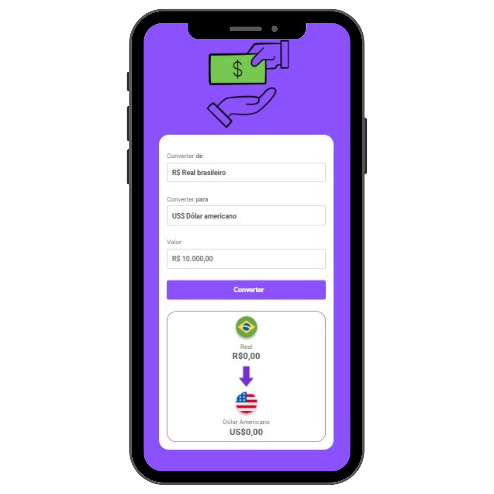

git<h1 align="center">💰 Convert Money</h1>

  Aplicação simples e funcional para conversão de moedas em tempo real. 
  Desenvolvido com <strong>HTML</strong>, <strong>CSS</strong> e <strong>JavaScript</strong>.

---

<h2>💡 Sobre o projeto</h2>

  O <strong>Convert Money</strong> é uma aplicação que permite converter valores entre diferentes moedas de forma rápida e prática. 
  O projeto foi criado com o objetivo de praticar manipulação de DOM, eventos e responsividade utilizando tecnologias front-end puras.

---

<h2>🚀 Tecnologias utilizadas</h2>
<ul>
  <li>HTML5</li>
  <li>CSS3</li>
  <li>JavaScript (ES6+)</li>
  <li>Google Fonts (Roboto)</li>
</ul>

---

<h2>⚙️ Funcionalidades</h2>
<ul>
  <li>✅ Converter valores entre:
    <ul>
      <li>Real (BRL)</li>
      <li>Dólar americano (USD)</li>
      <li>Euro (EUR)</li>
      <li>Libra esterlina (GBP)</li>
      <li>Bitcoin (BTC)</li>
    </ul>
  </li>
  <li>✅ Conversões de qualquer moeda para qualquer moeda</li>
  <li>✅ Layout totalmente responsivo</li>
  <li>✅ Interface moderna e intuitiva</li>
</ul>

---

<h2>📱 Responsividade</h2>

<h3>💻 Versão Desktop</h3>

  

<h3>📱 Versão Mobile</h3>

  

---

<h2>🧠 Aprendizados</h2>

  Durante o desenvolvimento, foram aplicados conceitos de:

<ul>
  <li>Manipulação de DOM com <code>document.querySelector()</code></li>
  <li>Eventos com <code>addEventListener()</code></li>
  <li>Formatação monetária com <code>Intl.NumberFormat</code></li>
  <li>Uso de estruturas condicionais <code>if/else</code></li>
  <li>Responsividade com <code>@media queries</code></li>
</ul>

---

<h2>📂 Estrutura do projeto</h2>
<pre>
📁 convert-money
├── 📄 index.html
├── 🎨 styles.css
├── ⚙️ script.js
└── 🖼️ assets/
     ├── money-gif.gif
     ├── real.png
     ├── usa.png
     ├── euro.png
     ├── libra.png
     ├── bitcoin.png
     ├── arrow.png
     └── (imagens de responsividade)
</pre>

---

<h2>🧾 Como executar o projeto</h2>
<ol>
  <li>Clone este repositório:</li>
  <pre><code>git clone https://github.com/seu-usuario/convert-money.git</code></pre>
  <li>Abra o arquivo <code>index.html</code> no navegador.</li>
  <li>Pronto! 🚀</li>
</ol>

---

<h2>👨‍💻 Autor</h2>

  Desenvolvido por <strong>Eduardo Martins</strong> 🖥 
  <a href="https://www.linkedin.com/in/eduardo-martins-35090428a/">📎 LinkedIn</a>

